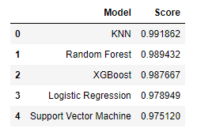
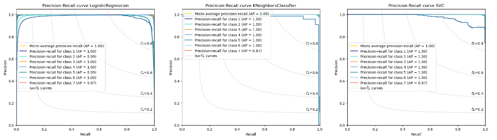

## Intro
In this project, I will try to use machine learning for prediction cropland pieces.

## Dataset description

This project is based on the "Crop mapping using fused optical-radar dataset", created by Dr. Iman Khosravi and taken from to [the University of California, Irvine (UCI) Machine Learning Repository)](https://archive.ics.uci.edu/ml/datasets/Crop+mapping+using+fused+optical-radar+data+set)

The dataset chosen for this machine learning exercise contains fused, bi-temporal optical-radar data for cropland classification, in tabular form, derived from images collected by RapidEye satellites (optical) and polarimetric radar information collected by Unmanned Aerial Vehicle Synthetic Aperture Radars (UAVSAR) over an agricultural region near Winnipeg, Canada on July 5th and July 14th, 2012. In this area, seven different crop cultures existed at the time of collection:

1. Corn
2. Pea
3. Canola
4. Soy
5. Oat
6. Wheat
7. Broadleaf
   
The dataset has 325,834 observations, each containing 175 attributes structured the following way:

**Dependent variable:**

- Crop class, as described above ('label', integer value ranging from 1 to 7);
  
**Predictive features:**

- Polarimetric radar features (49) collected on July 5th, 2012 ('f1' to 'f49', real values);
- Polarimetric radar features (49) collected on July 14th, 2012 ('f50' to 'f98', real values);
- Optical features (38) collected on July 5th, 2012 ('f99' to 'f136', real values);
- Optical features (38) collected on July 14th, 2012 ('f137' to 'f174', real values).

## Implementation

In this project, I used 5 machine learning algorithms:
- Logistic Regression
- KNN
- SVM
- Random Forest
- XGBoost

All models were able to solve this problem quite accurately. KNN had the best result:

Precision-Recall curve for KNN, SVM and Logistic Regression:

ROC for KNN, SVM and Logistic Regression:

## Conclusion
  1. First and foremost, results confirm that the combination of optical and radar-based information leads to very accurate remote cropland mapping
  2. Once again the importance of proper data preprocessing was revealed. This particular dataset - which proved at the end to be very robust and representative - was originally affected by severe feature intercorrelation. After dropping, the number of features was substantially reduced from 174 down to 103 (41 % decrease)
  3. More 'confusion' is experienced between 'wheat' and 'oat' crop cultures, which account for the highest numbers of incorrect predictions
  4. In general terms, accuracies per crop class did not differ much - all above 99%. The exception was the 'broadleaf' class, where accuracies were relatively lower. This should be expected, as this is the most misrepresented class (smallest number of observations)
