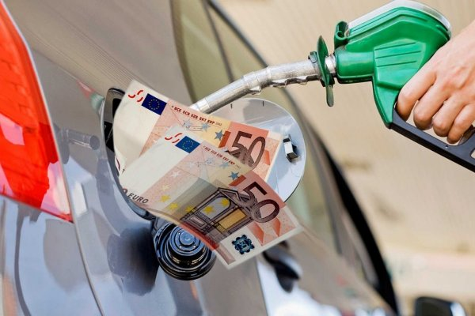
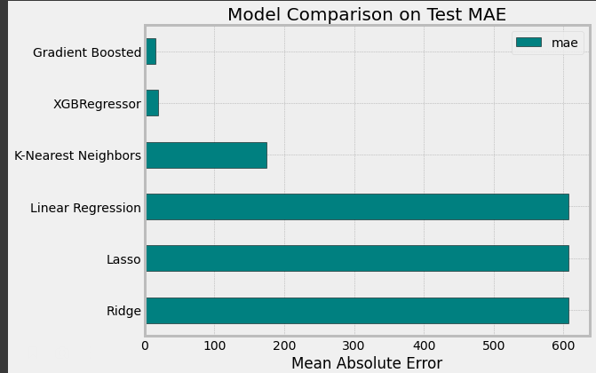
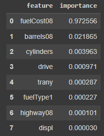
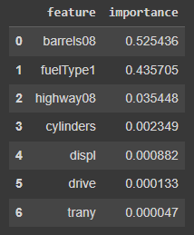

In this project, I will walk through solving a machine learning problem using the dataset of fuel economy taken from [fueleconomy.gov](https://www.fueleconomy.gov/feg/ws/index.shtml#vehicle) and define a model that can determine what affects the cost of fuel the most.

## Сontent
1. [Structure of project](#Structure-of-this-project)
2. [Data description](#Data-description)
3. [Conclusion](#Conclusion)

## Structure of this project:

- Load in the data and examine
- Exploratory data analysis
- Feature engineering and selection
- Establish a baseline and compare several machine learning models on a performance metric
- Perform hyperparameter tuning on the best model to optimize it for the problem
- Evaluate the best model on the testing set
  
For convenience, the project is divided into two notebooks.

## Data description
The purpose of EPA’s fuel economy estimates is to provide a reliable basis for comparing vehicles. Most vehicles in the database (other than plug-in hybrids) have three fuel economy estimates: a “city” estimate that represents urban driving, in which a vehicle is started in the morning (after being parked all night) and driven in stop-and-go traffic; a “highway” estimate that represents a mixture of rural and interstate highway driving in a warmed-up vehicle, typical of longer trips in free-flowing traffic; and a “combined” estimate that represents a combination of city driving (55%) and highway driving (45%). Estimates for all vehicles are based on laboratory testing under standardized conditions to allow for fair comparisons.

The database provides annual fuel cost estimates, rounded to the nearest $50, for each vehicle. The estimates are based on the assumptions that you travel 15,000 miles per year (55% under city driving conditions and 45% under highway conditions) and that fuel costs $2.33/gallon for regular unleaded gasoline, $2.58/gallon for mid-grade unleaded gasoline, and $2.82/gallon for premium.

EPA’s fuel economy values are good estimates of the fuel economy a typical driver will achieve under average driving conditions and provide a good basis to compare one vehicle to another. However, your fuel economy may be slightly higher or lower than EPA’s estimates. Fuel economy varies, sometimes significantly, based on driving conditions, driving style, and other factors.

## Conclusion
The task can be solved using machine learning. The best models to solve this problem are shown in the picture below:

### The most important features:
consider fuelCost08 and ignored fuelCost08                          
 

- fuelCost08 - annual fuel cost for fuelType1 ($) 
- barrels08 - annual petroleum consumption in barrels for fuelType1
- cylinders - engine cylinders
- drive - drive axle type
- trany - transmission
- fuelType1 - fuel type 1. For single fuel vehicles, this will be the only fuel. For dual fuel vehicles, this will be the conventional fuel.
- highway08 - highway MPG for fuelType1
- displ - engine displacement in liters
